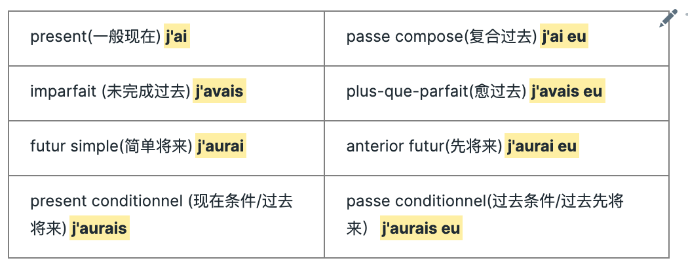
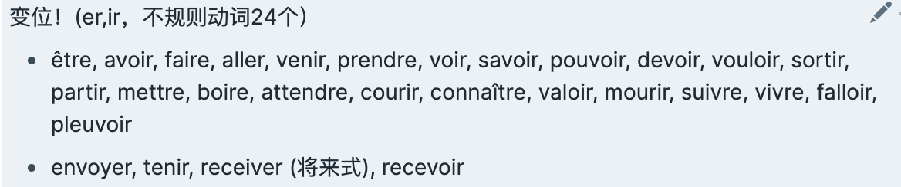
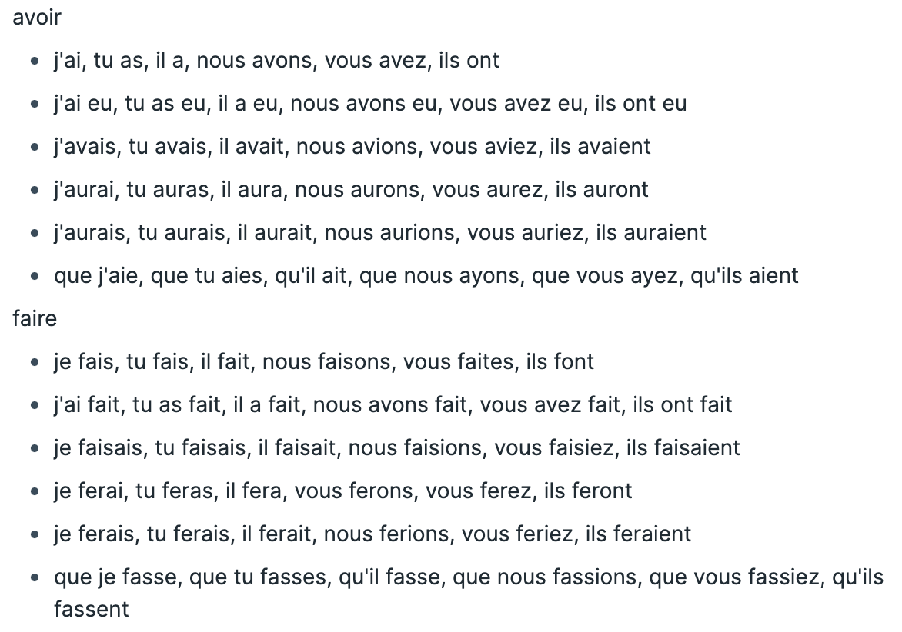

我在前文自主学习指南(三)里面已经赠送了免费且基本的法语学习课程及工具大礼包，这里想补充一点学习过程中的经验，含我曾经试验过且有效的方法。

## 语法：
学语法最重要的是搞清楚你目前的紧急需求是应试还是应用，这个问题的答案决定了你当下对语法的学习应该细致到什么程度，以应试为主的要抓细节，以应用为主的话，语法能理解框架和基本原则就可以。
对于语法，你可以考虑用这本[巴黎索邦大学语法教程](https://book.douban.com/subject/24875533/)当你的工具书，就和查字典一样，哪里不会找哪里。如果有时间，可以自己用思维导图做一个语法树，入门的思路就是抓大放小，先理解主干，语言最重要的特点。
我个人觉得，只要开始学罗曼语系的外语，需要理解的最核心的两点是：
1. 冠词、名词、形容词的性数格一致性
- 冠词、名词、形容词都有阴阳性单复数，且使用时变化一致
2. 动词：时态Vs语态

- 时态是过去、今天、未来，表时间的；
- 语态是陈述、疑问、感叹、虚拟、命令、条件，表态度的。

- 法意葡西这些语言的动词变位是时态和语态的双重混合变位，就是说通过一个动词的词根，你既可以知道时间，又能够领会到这个人的态度，两两组合在一起构成了复杂的动词变位。可以先分开理解这两个东西，然后你会发现，最常用和最基础的其实就是陈述和时间的混合，A2加条件，B1加虚拟。总之，先把一般陈述+时间的组合运用熟练。

tip: 真学下来，你也发现都是有规律的，常用的，把左边四个记住，右边的再加过去分词。

## 单词：
背单词当然有很多方法，不过我建议你直接背课文、背对话，把课文有主角的故事，主角全换成自己，假想为自己遇到的各种情况记下来。还有一个原因是，法语的连音和省音太多了，一个单词单独念和一个单词放在句子里，完全是两码事，一个法语句子以单词为单位和以音节为单位，根本不是一个东西..在加上单词本身有单复数和变位的需要，背单词的意义只能是混个眼熟，真正要当好朋友还是反复的读和说出来。

如果你实在喜欢用记忆卡片，那也还是有工具的，很多现成的单词卡，自己搜就好：
- Quizlet
- Memrise
- Anki

这里主要想分享的不是这个单词工具，而是以下这个列表：主打24个特殊现在式变位 （包括15个将来式特殊词根和20个特殊过去分词）

入门要把以上单词的变位能做到脱口而出，这些都是常用词且变为不规则，说话的时候不会给你时间考虑，都是无脑张嘴就来，争取 je suis, tu es, il est, nous sommes, vous etes, ils sont这个模式所有的单词都过一遍，注意是要非常熟练的脱口而出，因为有连音，你分开人称和动词，可能一个法国人就听不懂了，比如il est，你发成“yi lai” 和" yil ai"这是两码事。

另外就是，你实在觉得入门困难，没有接触过这种复杂的动词变位，那就先只记第三人称单数吧，一个是因为末尾不发音的情况下，很多单数第一/二人称和第三人称发音一样，二是"我们"在法语中可以用on替代，on的变位又是按照第三人称走，这样六个人称你可以偷懒用1个变位给混过4个去，二八法则的经典应用。

相反，如果你学有余力，每个单词就都这样，做到滚瓜烂熟：

## 听力
听力是法语的难点，也是学习重点，就是泛听+老老实实的跟读模仿——听写、影子练习、背诵三部曲。
你想省事儿的话，我推荐你直接去购买蜗牛法语的听力训练营，难得性价比超高的好课，找和自己水平对应的课程，跟着练习就行。

如果你想自己来，其实模板都是一样的，无非就是一个是老师给准备好的，一个是自己做：

1. 第一步：提前一星期找到合适的材料，先阅读，圈出生词，学习一下，熟悉一下发音，最好一篇不要超过10个/1分钟，这个量你可以按照自己的情况再调整，这是我的舒适区。阅读之后也确定一下你是可以泛听听懂大概意思的。
2. 第二步：一个星期以后，你单词应该有印象，但是文本忘记了，这个时候开始听，一句一句听写，分辨出自己是因为连诵、省音还是语法结构不懂、自己平时发音不准等等导致的听写失误。
3. 第三步：大声跟读，用播放软件的0.8x-1.2x，或多或少看你的需要，慢速读、快速读、正常读，和原听力对比，读到近似。
4. 第四步：或者背下来，或者你运用这里面学到的单词和短语，用自己的话概括下来。
此方法适用于任何语言。在法语学习里，与等级合适的材料见RFI Savior或者TV5MONDE。

## 口语
如果听力的跟读和背诵踏踏实实做好了，那么口语的基础应该不会差的。这里补充两个可以用到的内容：
[DeepL翻译神器](https://www.deepl.com/en/translator)

其实还是背诵，但是和自己相关的，背起来容易。就是从你的个人介绍开始，你写中文英文都好，用deepl翻译完了背下来，把你各个方面的兴趣爱好，小时候的事情，未来的计划全都写一圈，翻译完了，读熟背下来，然后你出门不要怂，遇到机会就说，追问就再背个相关的事儿，口语就能练起来了。

如果你想找人纠正你的发音，可以参考这个网站：[Speechling](https://speechling.com/) 能免费，就是有限量。

## 写作
这个真没捷径了，就是阅读完了多练习归纳和评论然后改，你如果去报班，我看市面上大多以应试为主，学到的其实都是考试的套路句子，对真正的写作帮助一般。我也懒，现在google doc有自动更正，导致我的写作感觉不进反退。

阅读就没什么好讲得了，只要上面都做到了，阅读是伴随提升不用刻意花时间的。还有什么难点是我忘了的？欢迎提问，我想到新的再补充。 
